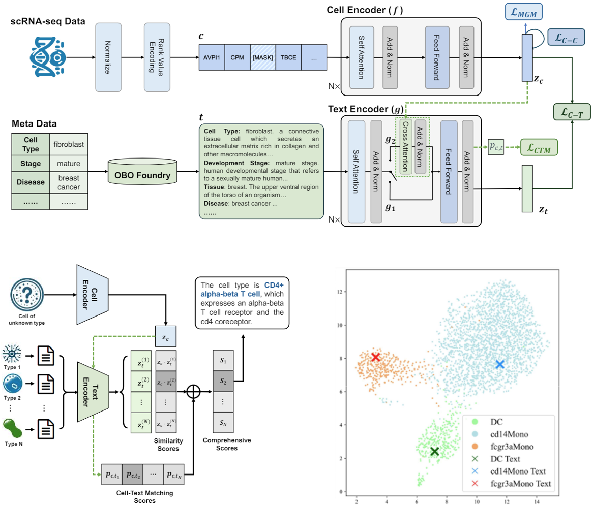

# LangCell: Language-Cell Pre-training for Cell Identity Understanding


Cell identity encompasses various semantic aspects of a cell, including cell type, pathway information, disease information, and more, which are essential for biologists to gain insights into its biological characteristics. Understanding cell identity from the transcriptomic data, such as annotating cell types, have become an important task in bioinformatics. 
As these semantic aspects are determined by human experts, it is impossible for AI models to effectively carry out cell identity understanding tasks without the supervision signals provided by single-cell and label pairs. 
The single-cell pre-trained language models (PLMs) currently used for this task are trained only on a single modality, transcriptomics data, lack an understanding of cell identity knowledge. As a result, they have to be fine-tuned for downstream tasks and struggle when lacking labeled data with the desired semantic labels.
To address this issue, we propose an innovative solution by constructing a unified representation of single-cell data and natural language during the pre-training phase, allowing the model to directly incorporate insights related to cell identity.
More specifically, we introduce **LangCell**, the first **Lang**uage-**Cell** pre-training framework. 
LangCell utilizes texts enriched with cell identity information to gain a profound comprehension of cross-modal knowledge.
Results from experiments conducted on different benchmarks show that LangCell is the only single-cell PLM that can work effectively in zero-shot cell identity understanding scenarios, and also significantly outperforms existing models in few-shot and fine-tuning cell identity understanding scenarios.

More information can be found at [https://arxiv.org/abs/2405.06708](https://arxiv.org/abs/2405.06708).

LangCell will soon be added to the OpenBioMed toolkit: [https://github.com/PharMolix/OpenBioMed](https://github.com/PharMolix/OpenBioMed).



# News
- [2024/12/30] Released pre-training dataset [**scLibrary**](https://huggingface.co/datasets/Toycat/scLibrary/tree/main) 

# Install

[](https://www.python.org/) 
```
pip install -r requirements.txt
```

# Checkpoint 

The model's checkpoint is divided into five modules: text_bert, cell_bert, text_proj, cell_proj, and ctm_head. Users can select and load the necessary modules according to the downstream task requirements. Among them, cell_bert is the standard Huggingface BertModel; text_bert is a multifunctional encoder provided in utils.py; cell_proj and text_proj are linear layers that map the model outputs corresponding to the [CLS] position in cells and text to a unified feature space; and ctm_head is a linear layer that maps the output of text_bert to matching scores when performing Cell-Text Matching. For specific loading methods, please refer to the usage in `LangCell-annotation-zeroshot/zero-shot.ipynb`.

[Download checkpoint](https://drive.google.com/drive/folders/1cuhVG9v0YoAnjW-t_WMpQQguajumCBTp)

# Pre-training Dataset

We constructed a cell-text dataset, **scLibrary**, containing 27.5 million scRNA-seq entries along with their descriptions. Specifically, we obtained raw scRNA-seq data and corresponding metadata from CELLxGENE. We selected eight critical aspects of cell identity that could contain essential insights, including cell type, developmental stage and disease information, to obtain as comprehensive descriptions as possible from the Open Biological and Biomedical Ontology Foundry (OBO Foundry).

[Download scLibrary](https://huggingface.co/datasets/Toycat/scLibrary/tree/main)

# Usage 
 
- **Data preprocess**  
Similar to the example in `data_preprocess/preprocess.py`, you can use `scanpy` to read any single-cell data and process it into a format accepted by the model. The processing method is similar to `Geneformer`. For more detailed instructions, please refer to [Geneformer's tokenizing scRNAseq data example](https://huggingface.co/ctheodoris/Geneformer/blob/main/examples/tokenizing_scRNAseq_data.ipynb).


- **LangCell zero-shot cell type annotation**  
We strongly recommend that users unfamiliar with LangCell start by experiencing this core task to quickly understand the features and usage of LangCell. We have prepared a [demo dataset](https://drive.google.com/drive/folders/1cuhVG9v0YoAnjW-t_WMpQQguajumCBTp?usp=sharing) for this task; you just need to download the dataset and run `LangCell-annotation-zeroshot/zero-shot.ipynb`.

- **LangCell few-shot cell type annotation**  
LangCell's performance can be further enhanced by performing few-shot training on a very small amount of data. You can run the code using the following commands:
```
cd LangCell-annotation-fewshot/

python fewshot.py --data_path [data_path] --model_path [model_path] --nshot [nshot] --device [device] 
```

- **LangCell-CE cell type annotation**  
Experiments have proven that fine-tuning using only LangCell's Cell Encoder (LangCell-CE) can also achieve excellent performance on downstream tasks. You can run fine-tuning and few-shot experiments with LangCell-CE using the following commands:
```
cd LangCell-CE-annotation/

python finetune.py --data_path [data_path] --model_path [model_path] --device [device] 

python fewshot.py --data_path [data_path] --model_path [model_path] --nshot [nshot] --device [device] 
```

- **Textual descriptions of cell identities**  
We have uploaded the OBO Foundry file "obo.json" [here](https://drive.google.com/drive/folders/1cuhVG9v0YoAnjW-t_WMpQQguajumCBTp), which contains textual descriptions of common cell identities. You can use these as examples to write textual descriptions for new cell types.

- **We will update more experimental code for LangCell in the future.**


# Citation
If you find LangCell helpful to your research, please consider giving this repository a 🌟star and 📎citing the following article. Thank you for your support!
```
@misc{zhao2024langcell,
      title={LangCell: Language-Cell Pre-training for Cell Identity Understanding}, 
      author={Suyuan Zhao and Jiahuan Zhang and Yizhen Luo and Yushuai Wu and Zaiqing Nie},
      year={2024},
      eprint={2405.06708},
      archivePrefix={arXiv},
      primaryClass={q-bio.GN}
}
```
